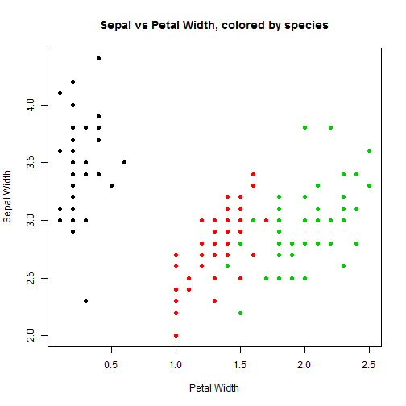

## Simple classification of Iris Species

I created a small app that will classify the species of iris based on Sepal and Petal Length. It is based on the irises datasets in R. It takes in a petal width and a sepal width and returns the likely species.  

The app itself is done using the R library Shiny, which can create interactive applications. I used a slider to change the sepal and petal width.

---

## Loading dataset

For some preliminary analysis, we load the dataset and look at the first five lines. This will give us an idea of what the data looks like.

```r
library(datasets)
head(iris, 5)
```

```
##   Sepal.Length Sepal.Width Petal.Length Petal.Width Species
## 1          5.1         3.5          1.4         0.2  setosa
## 2          4.9         3.0          1.4         0.2  setosa
## 3          4.7         3.2          1.3         0.2  setosa
## 4          4.6         3.1          1.5         0.2  setosa
## 5          5.0         3.6          1.4         0.2  setosa
```

---

## Plot of data


```r
plot(Sepal.Width ~ Petal.Width, data = iris, col = Species, xlab = "Petal Width",
     ylab = "Sepal Width", main = "Sepal vs Petal Width, colored by species", pch=19)
```

 

---

## Algorithm
Through a decision tree, I found some predictors for species. Hence my algorithm became the following:

```r
categorize <- function(pet, sep) {
  if (pet < .8) {
    return("Setosa")
  }
  if (pet < 1.35 | (pet < 1.75 & sep > 2.65)){
    return("Versicolor")
  }
  else {
    return("Virginica")
  }
}
```

This misclassifies 3 points, which is respectable.

---

## Discussion and Examples
Although this is not necessarily a perfect algorithm - for example, what if the petal width is between .6 and 1 - it gives a fairly good understanding of what will happen. Just to show that the algorithm works as expected, here are a few examples


```r
categorize(.5, 5)
```

```
## [1] "Setosa"
```

```r
categorize(1.2, 1)
```

```
## [1] "Versicolor"
```

```r
categorize(2.5, 3)
```

```
## [1] "Virginica"
```
